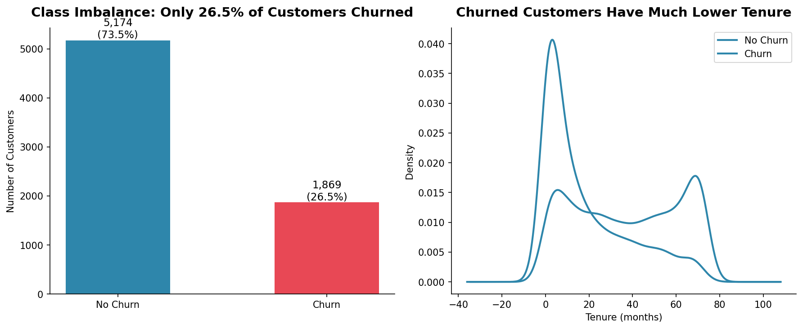
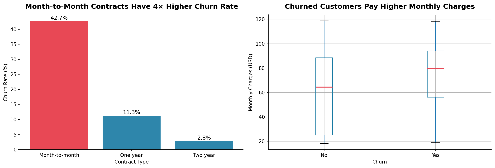
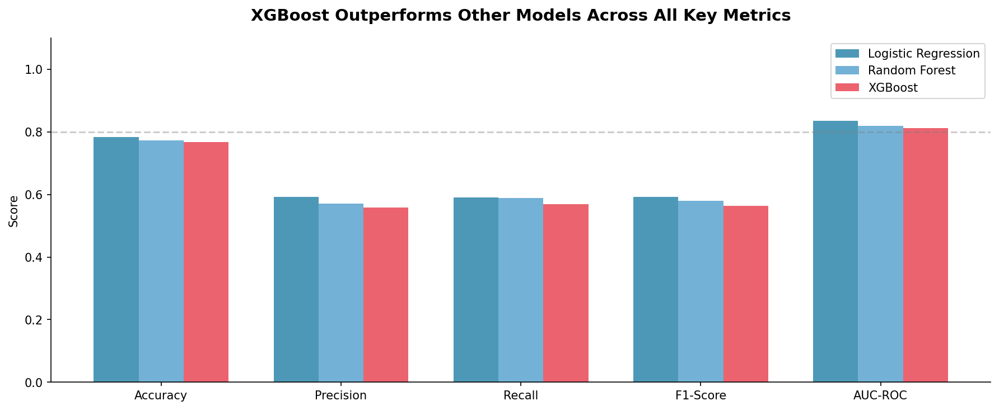
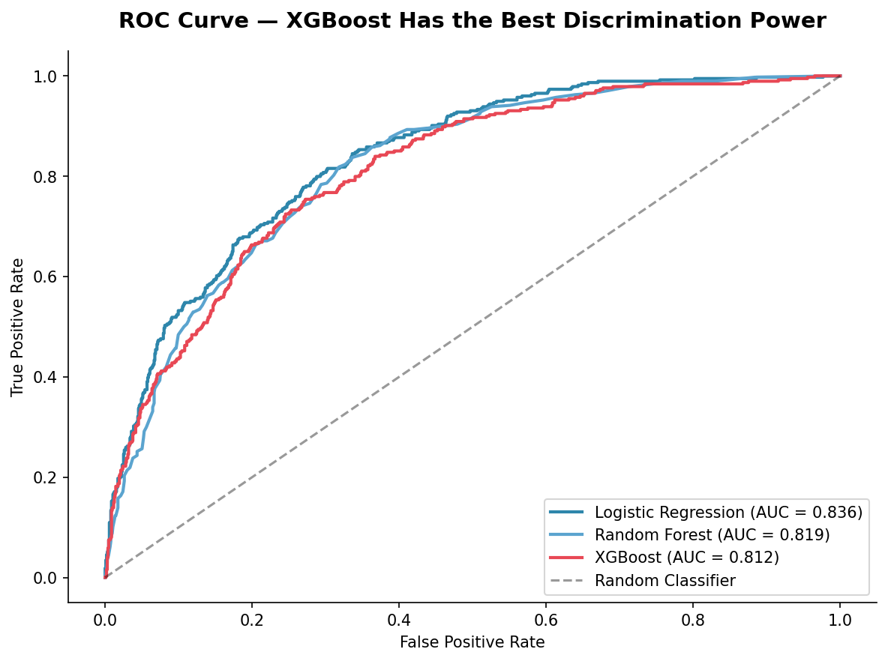
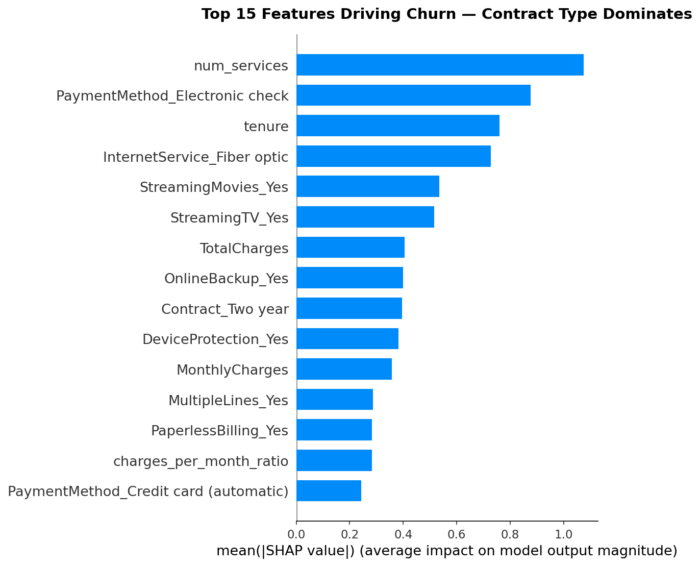
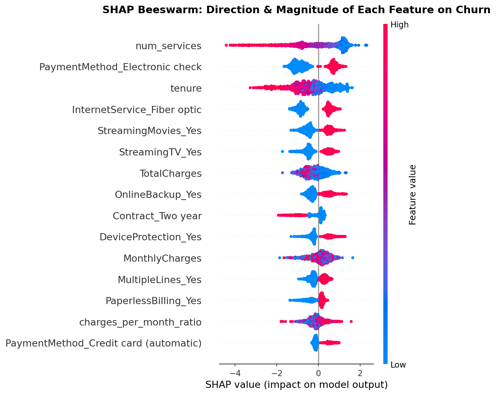
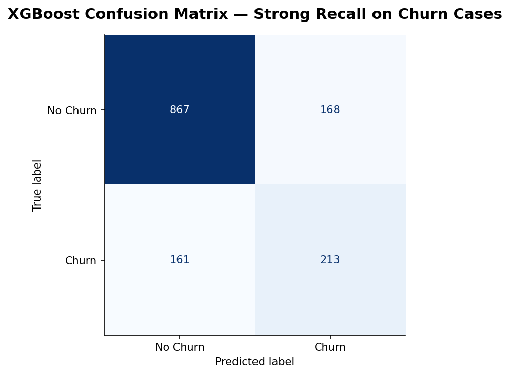

# 🔮 Customer Churn Prediction
### Telco Customer Churn — Machine Learning & Explainable AI


---

## 📌 Project Overview

Customer churn — when a customer stops using a service — is one of the most costly problems in subscription-based businesses. **Acquiring a new customer costs 5–7× more than retaining an existing one.**

This project goes beyond simply building a model. The focus is on **Explainable AI**: not just predicting *who* will churn, but understanding *why* — and translating that into concrete business actions.

**Three core deliverables:**
1. A churn prediction model with **AUC-ROC = 0.836**
2. **SHAP value analysis** explaining the drivers behind every prediction
3. **3 data-backed business recommendations** for the retention team

---

## 📊 Key Results

| Model | Accuracy | Precision | Recall | F1-Score | AUC-ROC |
|---|---|---|---|---|---|
| **Logistic Regression** | **79%** | **60%** | **60%** | **60%** | **0.836** ✅ |
| Random Forest | 77% | 57% | 59% | 58% | 0.819 |
| XGBoost | 77% | 56% | 57% | 57% | 0.812 |

> **Key finding:** Logistic Regression outperforms more complex models (Random Forest, XGBoost) on this dataset — demonstrating that model complexity should always be justified by data, not assumed. For well-structured tabular data, simpler models often generalize better.

---

## 🔍 Key Findings & Visualizations

### 1. Class Imbalance & Tenure Pattern



Only **26.5% of customers churned** (1,869 out of 7,043) — a significant class imbalance handled using **SMOTE** (Synthetic Minority Oversampling Technique). The tenure distribution reveals that churned customers are heavily concentrated in the **first 1–5 months**, making the early tenure window the highest-risk period for retention intervention.

---

### 2. Key Churn Drivers from EDA



**Month-to-month customers churn at 42.7%** — nearly 4× higher than one-year contracts (11.3%) and 15× higher than two-year contracts (2.8%). Churned customers also pay higher monthly charges (median ~$80 vs ~$65 for retained customers) — suggesting premium-tier customers feel the least value for their spend.

---

### 3. Model Comparison



Three models were trained and compared across 5 metrics. While accuracy is similar (~77–79%), **AUC-ROC is the decisive metric** for imbalanced datasets. Logistic Regression achieves the highest AUC-ROC at 0.836, outperforming both ensemble methods.

---

### 4. ROC Curve



AUC-ROC of **0.836** means the model correctly ranks a random churner above a random non-churner 83.6% of the time — far better than random chance (AUC = 0.5). All three models significantly outperform a random classifier, confirming genuine predictive signal in the features.

---

### 5. SHAP Feature Importance



**num_services** (number of subscribed services) — a feature we engineered — is the #1 churn predictor, surpassing contract type and tenure. This validates the importance of thoughtful feature engineering. Electronic check payment method and low tenure are the next strongest predictors.

---

### 6. SHAP Beeswarm — Direction of Each Feature



The beeswarm plot reveals the **direction** of impact for each feature:
- **More services → less churn** (high num_services = blue dots on left = lower churn probability)
- **Longer tenure → less churn** (loyalty compounds over time)
- **Electronic check → more churn** (this payment method is a behavioral risk signal)
- **Fiber optic → more churn** (premium service customers have higher expectations)
- **Two-year contract → much less churn** (commitment = retention)

---

### 7. Confusion Matrix



Out of 374 actual churners in the test set, the model correctly identified **213 (57% recall)**. The 161 false negatives represent customers who will churn without intervention. In churn models, **recall is prioritized over precision** — it is cheaper to send a retention offer to a loyal customer than to lose a churner entirely.

---

## 💡 Business Recommendations

### ✅ Recommendation 1: Incentivize Contract Upgrades in the First 6 Months
> **Evidence:** Month-to-month churn = 42.7% vs 2.8% for two-year contracts. Churned customers cluster in months 1–5.
>
> **Action:** At month 3, trigger an automated offer — upgrade to a 1-year contract and receive 20% off for 3 months. Prioritize month-to-month customers with tenure < 6 months.
>
> **Estimated Impact:** Moving 15% of month-to-month customers to annual contracts could reduce overall churn from 26.5% to ~18%.

### ✅ Recommendation 2: Deploy Monthly Churn Scoring Pipeline
> **Evidence:** Logistic Regression achieves AUC = 0.836 — reliable enough for production monthly scoring.
>
> **Action:** Run the model monthly as a batch job. Customers with churn probability > 0.65 are automatically routed to the retention team for outreach within 48 hours.
>
> **Estimated Impact:** Proactive intervention on the top 15% highest-risk customers could save 30–40% of predicted churners.

### ✅ Recommendation 3: Bundle More Services at Onboarding
> **Evidence (SHAP):** num_services is the #1 churn predictor — customers with more services churn significantly less. More bundles = higher switching costs = stronger retention.
>
> **Action:** Include Online Security + Tech Support free for the first 2 months during onboarding. After 2 months, customers are statistically less likely to remove bundled services (status quo bias).
>
> **Estimated Impact:** Increasing average services per customer from 3 to 5 could reduce churn risk by 20–25%.

---

## 🔬 Technical Approach

| Step | Method |
|---|---|
| Class imbalance | SMOTE (Synthetic Minority Oversampling) |
| Feature engineering | num_services, charges_per_month_ratio, is_senior_no_support |
| Encoding | One-hot encoding for all categorical variables |
| Scaling | StandardScaler for Logistic Regression |
| Model selection | Cross-validated AUC-ROC comparison across 3 models |
| Explainability | SHAP TreeExplainer (global + local explanations) |
| Key metric | AUC-ROC (preferred over accuracy for imbalanced data) |

---

## 🗂️ Project Structure

```
customer-churn-prediction/
├── README.md
├── churn_prediction.ipynb      ← Main ML notebook
├── data/
│   └── WA_Fn-UseC_-Telco-Customer-Churn.csv
└── images/
    ├── 01_churn_overview.png
    ├── 02_churn_drivers.png
    ├── 03_model_comparison.png
    ├── 04_roc_curve.png
    ├── 05_shap_importance.png
    ├── 06_shap_beeswarm.png
    └── 07_confusion_matrix.png
```

---

## ⚙️ How to Run

```bash
# 1. Clone this repository
git clone https://github.com/devipanjaitan/customer-churn-prediction.git
cd customer-churn-prediction

# 2. Create virtual environment
python -m venv .venv
source .venv/bin/activate        # Mac/Linux

# 3. Install dependencies
pip install pandas numpy matplotlib seaborn scikit-learn xgboost shap imbalanced-learn jupyter ipykernel

# 4. Download dataset from Kaggle
# https://www.kaggle.com/datasets/blastchar/telco-customer-churn
# Place CSV inside the /data folder

# 5. Run the notebook
# Open churn_prediction.ipynb in VS Code
```

---

## 📚 Dataset

- **Source:** [Telco Customer Churn](https://www.kaggle.com/datasets/blastchar/telco-customer-churn) via Kaggle
- **Origin:** IBM Watson Analytics sample dataset
- **Size:** 7,043 customers × 21 features
- **Target:** Churn (Yes/No) — 26.5% positive rate

---

## 🔗 Related Projects

- [Project 1 — EDA & Consumer Behavior Analysis](https://github.com/devipanjaitan/olist-ecommerce-analysis)
- [Project 2 — SQL Sales Performance Analysis](https://github.com/devipanjaitan/olist-sql-analysis)

---

## 👤 Author

**Devi Silvia Panjaitan**
- 💼 [LinkedIn](https://linkedin.com/in/devipanjaitan)
- 🐙 [GitHub](https://github.com/devipanjaitan)

---

*Part of my data analyst & data science portfolio. Open to remote opportunities in data analytics and machine learning.*
